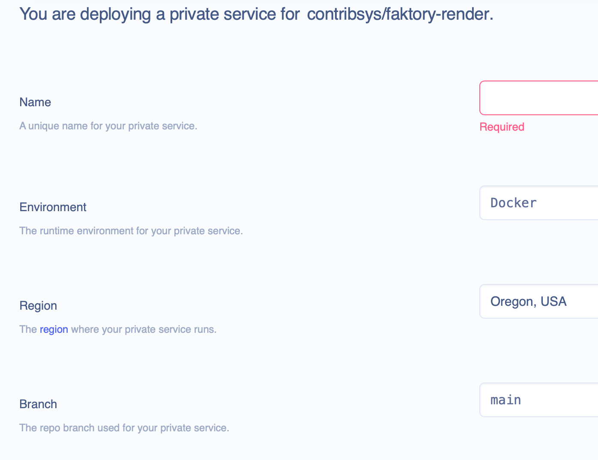
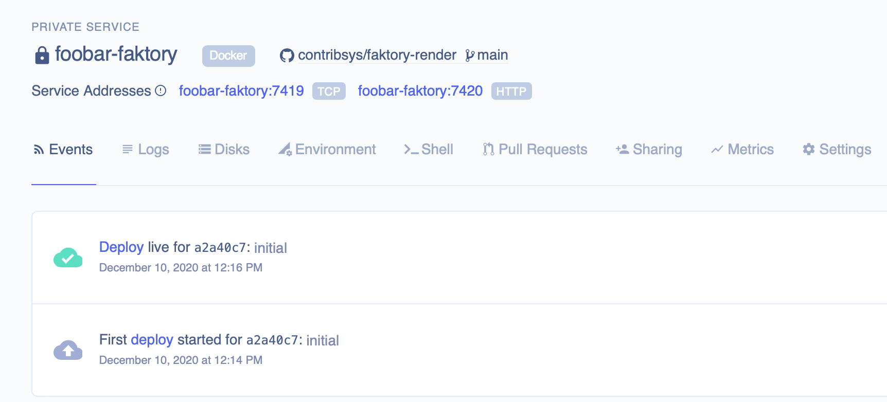

## Deploying Faktory to Render.com

[Render](https://render.com) is a SaaS which makes it really easy to deploy custom
Docker-based services around the world with a few clicks.
[Faktory](/contribsys/faktory/wiki) is a
persistent background job system for any programming language. Let's get a Faktory
instance running for your app.

1. Sign in at Render.com.
2. On your Dashboard, select "New Private Service".
3. Paste in the URL for this repo:
   https://github.com/contribsys/faktory-render and click the box that
appears.

4. Customize it:
  - Enter a unique name for your Faktory server: "faktory", "foobar-faktory", etc.
  - Select an appropriate region "near" your app.
  - Notice you can set ENV variables or secrets files, useful for
    FAKTORY_LICENSE if you upgrade to Faktory Pro or Enterprise.
  - Change the value for FAKTORY_PASSWORD in Environment Variables.
  - Select an appropriate instance size and create a persistent disk for
    your data, mounted at /var/lib/faktory. See sizing notes below.
  - Click "Create Private Service". You should have a live Faktory
    instance in a minute. Both ports should be accessible to your app
    running in Render.

### Resource Sizing

Faktory doesn't need much disk because queues are typically empty. Only
your error queue and scheduled queue will contain long-term data so I
recommend going small: 5-10GB should be plenty of space for most people.

Faktory uses Redis under the covers and all data must fit into RAM with
Redis. A small, test instance can run with 1GB. A light instance
processing less than 10m jobs/day can run with 2GB. For bigger users or users
using more data-heavy features like Batches, go with 4GB. Likewise, go
with 1, 2 or 4 CPUs based on your expected usage.

Remember we are spec'ing out the instance running Faktory **only**. It's your
worker instances that will actually execute jobs: that's where
you'll spend most of your resource budget.

### Limitations

Unfortunately private services are just that: private. You can't use a
Faktory service deployed to render.com with a generic app deployed in AWS
because there is no access to the service via public network.
If this changes, I will update this section with details.
